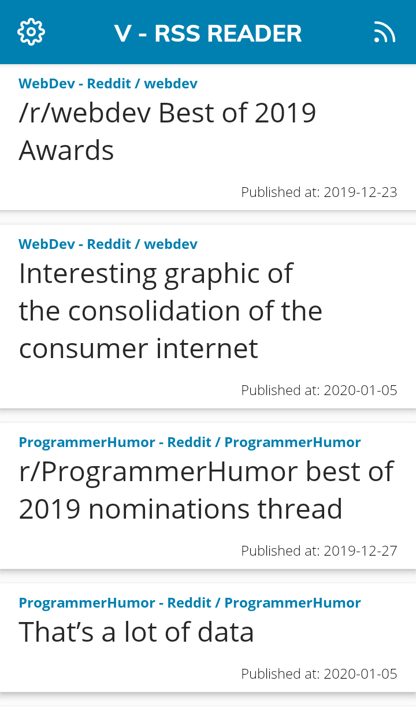

# V - RSS Reader
Are you in need to read world news from around the globe, news from your industry or maybe you're just interested in finding how your favourite sport team is doing? With **V** you don't need to follow multiple websites to be up date with every topic that you try to follow - you can have all of them in one place, in **V**.

  

## 📰 What is RSS?
RSS allows apps (which are called RSS Readers) like **V**, to receive recently added articles, blog posts or podcast episodes from page and then show titles of them (and sometimes other informations too) inside of one single app - without need to visit every website by yourself.
This allows you to be up to date with every thing that you're interested in via only one app.

You need to check by yourself if your news website supports it - search for RSS icon
 on website or google "[name of website] RSS".

## 🙋 FAQ:
**Q:** What data is stored and send by V - RSS Reader?\
**A:** You don't to worry about your privacy because settings, stats, themes and feeds you added to **V** is only stored on your device - to test it: reinstall app and you can see that everything looks like when you just first installed **V**.

**Q:** Does my data is encrypted?\
**A:** No, is not. And there's no need for it, because every data that's stored on your device (by **V**) is not a sensitive one.

**Q:** Is this free app?\
**A:** Yes, **V** is completely free.

**Q:** Where I can download it?\
**A:** If you want to use Google Play, [go here](https://play.google.com/store/apps/details?id=com.v) and if you don't need automatic updates you can download app from Github, [here](https://github.com/datguysheepy/v-rss-reader/releases) - *choose v.apk*.

**Q:** How to add RSS feed to app?\
**A:** Click on RSS icon on header, while being on home screen. And then on **+** icon on header.
Remember to create category first, if you didn't do it yet. Choose title of your choice and below paste link of RSS feed.

**Q:** From where can I get RSS link, how does it look like?\
**A:** As said before - search for RSS icon  on website, or search for RSS feed link with help of Google.

**Couple RSS feeds links examples, so you know what to search for:**
* *Frontpage of Reddit -* https://www.reddit.com/.rss
* *International news from The Guardian -* https://www.theguardian.com/international/rss
* *World news from BBC -* http://feeds.bbci.co.uk/news/video_and_audio/world/rss.xml

**Q:** How to delete RSS category?\
**A:** Long press of category name should bring pop-up to delete it.

**Q:** How to delete RSS feed?\
**A:** There's small bin icon on the right of the name of RSS feed - click it and it should bring pop-up to delete it.

**Q:** How to rename RSS feed?\
**A:** There's small rename icon on the right of the name of RSS feed - click it and it should bring pop-up to rename it.

**Q:** RSS feed changed to grayish color when I clicked on it, why?\
**A:** You can enable/disable specific RSS feeds from displaying news on home screen by clicking on name of it or by clicking on tick/box icon on the right of it.

**Q:** How does streaks works?\
**A:** If you open at least one news everyday your current streak should increase by 1. 

**Q:** Can I: rename category, change RSS feed link or disable/enable all feeds from one category by one click?\
**A:** No, at this moment **V** don't support this functionalities, but be sure to frequently update app, because at some point this functionalities probably will be added to app.

## 🤝 Contribution:
Contribution to development of **V - RSS Reader** is always welcomed and desired - You can contribute by choosing one of open issues and working on them or by creating new functionality that you think will greatly increase appeal of **V**, and then by creating Pull Request.

## 🐞 Hey I found a bug!
Something doesn't work like it should? If so, [go here to create issue](https://github.com/datguysheepy/v-rss-reader/issues/new) - please choose appropriate title and in description include everything that you think will be useful for fixing this bug/helping with your issue.

## 📝 License 
**V - RSS Reader** is open-source project licensed under the [GPL-3.0](https://github.com/datguysheepy/v-rss-reader/blob/master/LICENSE).