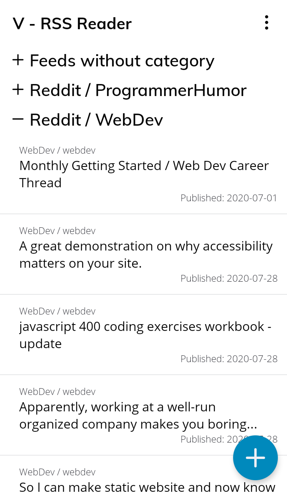
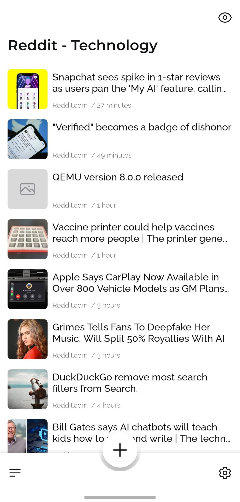

# V - RSS Reader
**V - RSS Reader** is a mobile app for Android that functions as an RSS reader, allowing you to access all your favorite articles in one place. With a simple and minimalistic design, you can keep up with the latest news on politics, business, sports, entertainment, and more - completely free.

### Features
* Access all your articles in one place.
* Completely free to use and download.
* No ads.
* Easily add and manage RSS feeds.
* Track your reading stats.
* Streaks - keep track of how many days in a row you have read an article.
* Customizable
* Minimalistic

### Screenshots
<table align="center">
	<tr>
		<td></td>
		<td></td>
		<td></td>
		<td></td>
	</tr>
	<tr align="center">
		<td>First version</td>
		<td>After first redesign</td>
		<td>Latest redesign</td>
		<td>Latest redesign functionalities</td>
	</tr>
</table>

## 📰 What is RSS?
RSS (Rich Site Summary) is a web feed that allows users and applications to access updates to websites in a standardized, computer-readable format. Subscribing to RSS feeds can allow a user to keep track of many different websites in a single news aggregator, which constantly monitors sites for new content, removing the need for the user to manually check them.

If you're interested in using RSS feeds to stay up-to-date on your favorite websites, **V - RSS Reader** is the perfect solution. You can download it for free from the Google Play store [here](https://play.google.com/store/apps/details?id=com.vrssreader.app).

## 🙋 FAQ:
**Q:** What data is stored and sent by **V - RSS Reader**?\
**A:** All settings, reading stats, feeds, and categories are stored completely on your device and never shared outside of it.

**Q:** Is my data encrypted?\
**A:** No, it is not. Since everything is stored on your device, there's no need to encrypt anything. However, if encryption is heavily requested, it may be added in a future update.

**Q:** Is this app free to use and download? Are there any ads?\
**A:** Yes, **V** is completely free to use and download, and there are no ads.

**Q:** Where can I download it?\
**A:** If you use an Android phone, you can download it from the Google Play store [here](https://play.google.com/store/apps/details?id=com.vrssreader.app). If you don't need automatic updates, you can download the "apk" file straight from the Github releases page [here](https://github.com/datguysheepy/v-rss-reader/releases).

**Q:** Is **V** available on iOS?\
**A:** No, currently the app is available only on Android devices. If this is something that would be really heavily requested then I may consider supporting it in the future

**Q:** How do I add an RSS feed to the app?\
**A:** Click on the "+" button at the bottom of the app and select the "Add new RSS feed" option. From there, it should be straightforward for you to create one.

**Q:** Where can I find an RSS link, and what does it look like?\
**A:** Unfortunately, not all websites/services support RSS feeds. But if they do, you can search for an [RSS icon](https://en.wikipedia.org/wiki/File:Feed-icon.svg) or a link that has "rss" in it. You can also use a search engine to check if a specific website supports RSS feeds. Here are a few examples of RSS feed links:

* Frontpage of Reddit - https://www.reddit.com/.rss
* International news from The Guardian - https://www.theguardian.com/international/rss
* World news from BBC - http://feeds.bbci.co.uk/news/video_and_audio/world/rss.xml

**Q:** How do I delete a category/feed?\
**A:** To delete a category/feed, select the category/feed that you wish to delete from the "Feeds" view. When it's active, click on the "Settings" icon at the bottom right of the screen, and you should find a "Delete category/feed" option there.

**Q:** How do I rename an RSS feed?\
**A:** To rename an RSS feed, follow the same instructions as when you want to delete one but choose the "Edit category/feed" option.

**Q:** How does streaks work?\
**A:** If you open at least one article every day, your current streak should increase by 1.

**Q:** I don't want **V** to collect my reading stats. Can I disable it?\
**A:** Yes, you can go to the Settings page and disable the collection of reading stats. On that view, you can also adjust more settings according to your liking.

## 🤝 Contribution
Contribution to the development of **V - RSS Reader** is always welcomed and desired. You can contribute by choosing one of the open issues and working on them, or by creating new functionality that you think will greatly increase the appeal of **V** and then creating a pull request.

## 🐞 Hey, I found a bug!
If something doesn't work as it should, you can go here to create an issue. Please choose an appropriate title, and in the description, include everything that you think will be useful for fixing the bug/helping with your issue.

## 📝 License
**V - RSS Reader** is an open-source project licensed under the [GPL-3.0](https://github.com/datguysheepy/v-rss-reader/blob/master/LICENSE).
